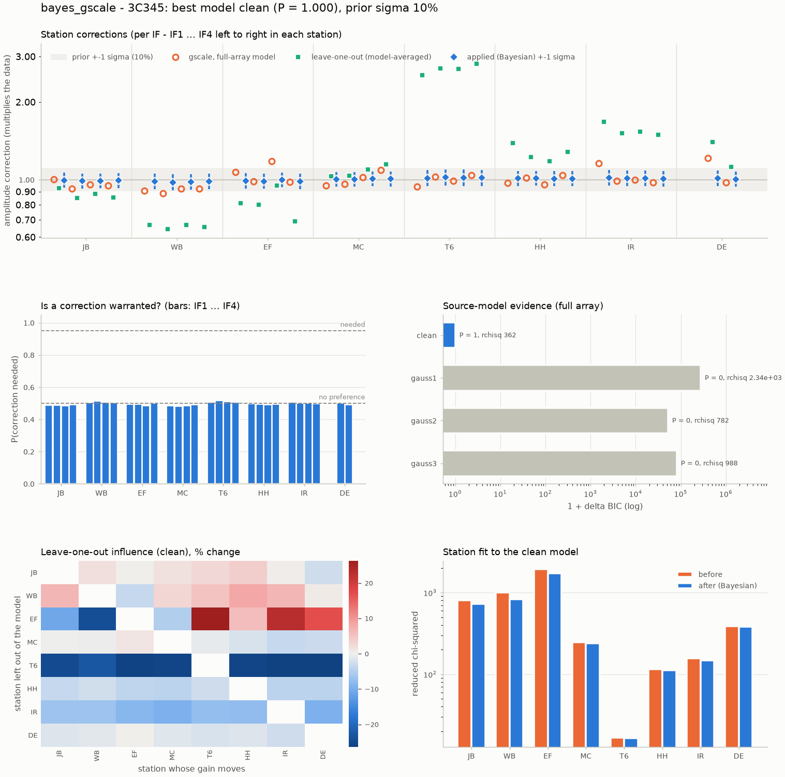

# Bayesian amplitude calibration

`gscale` finds one amplitude correction per station against a model -
but that model was built from the same data, so a station whose
amplitude scale is wrong has already pulled the model towards its error.
`bayes_gscale` breaks that circle and puts error bars on the result.

```python
r = obs.bayes_gscale(prefix="3C345_bayes")  # runs, applies, writes the report
print(r)                                    # the summary again
r.plot()                                    # the diagnostic figure
r.factors                                   # [IF, station] corrections applied
```

## What it does

1.  **Leave one station out.** For each station, and once for the full
    array, the source model is rebuilt with that station ignored, phase
    self-calibrating as it goes. The station is then brought back,
    phased up against that fixed model, and the whole array `gscale`d -
    so its correction comes from a model it had no say in. The runs that
    leave out the *other* stations give a jackknife spread.

    Where leaving a station out moves its own estimate a lot, that
    shift counts as systematic uncertainty too. It may mean the
    full-array model had absorbed the station's error - or just that the
    station's baselines reach spatial frequencies nobody else
    constrains, and the data cannot tell the two apart.

2.  **Compare source models.** The same is done for several model
    families - by default CLEAN and one to three Gaussians - and the
    full-array runs are weighed against each other by the Bayesian
    information criterion, with the chi-squared rescaled by the best
    model's reduced chi-squared (VLBI weights are rarely absolute). The
    corrections are averaged over models by their posterior
    probabilities.

3.  **Shrink to the prior.** Each log-amplitude correction is combined
    with a Gaussian prior centred on "no correction", of width
    `prior_sigma` (default 10%, the a-priori amplitude calibration
    accuracy). The Bayes factor between "a correction is needed" and
    "it is not" gives `P(needed)`, and what is applied is the posterior
    average over both - so corrections the data do not demand are left
    out, and those they do demand are applied in full.

!!! note "It is an approximation"

    The likelihoods are Gaussian throughout (in log amplitude for the
    gains) and the model evidence is BIC, which is what makes every
    step closed-form and the whole thing cheap enough to run on every
    station.

## Per IF

Like `gscale`, it solves every IF separately (`per_if=True`, the
default). The summary has one column per IF with the correction, its 1σ
uncertainty and a mark where it is needed (`*`, P ≥ 0.95) or probably
needed (`?`, P ≥ 0.75):

```
Station corrections (factors multiply the data; +- 1 sigma; * needed, P >= 0.95; ? probably, P >= 0.75;
prior sigma 10%):
  station         IF1 1.611G       IF2 1.642G       IF3 1.675G       IF4 1.706G  rchi2 before   after
  JB            0.972+-5.9%      0.947+-7.2%      0.958+-6.9%      0.977+-6.6%           1671   966.5
  WB            0.838+-8.0%*     0.811+-7.0%*     0.861+-8.5%?     0.914+-8.8%           2930     921
  EF            0.975+-6.4%      0.968+-6.7%      0.996+-5.7%      0.967+-7.2%           4699    2334
```

`per_if=False` combines the IFs into one correction per station.

## The diagnostics

{ loading=lazy }

- **Station corrections**: the plain full-array `gscale` (orange), the
  leave-one-out estimate (green) and the value applied with its
  uncertainty (blue), against the prior band - each station's IFs side
  by side.
- **Is a correction warranted?** `P(needed)` for each station and IF.
- **Source-model evidence**: how far each model is from the best.
- **Leave-one-out influence**: how much each station's gain moves when
  another is left out of the model.
- **Station fit**: each station's reduced chi-squared before and after.

## What it writes

With `prefix`:

| file | contents |
|---|---|
| `<prefix>.json` | settings, per-model evidence, per-station and per-IF corrections with uncertainties and probabilities, the influence matrix, every run, and the findings in words |
| `<prefix>.png` | the diagnostic figure (needs matplotlib) |
| `<prefix>.G` and/or `<prefix>.TASAV.FITS` | a calibration table of the constant corrections, for the other sources of the observation (`outformat`, `ms` and `uvfits` as for [`savecaltable`](caltables.md)) |

## Options worth knowing

`models`
:   The source models to compare: `"clean"` (`"clean500"` for 500
    iterations a round), `"gaussN"`, `"pointN"`, and `"current"` for the
    model already in the observation.

`prior_sigma`
:   How well you trust the a-priori amplitude calibration.

`timeavg`
:   Average the working copy first; the corrections are constant, so
    this costs little and speeds up long tracks.

`workers`
:   Threads to use. Every run works on its own copy of the observation,
    so they go in parallel: 36 runs on the 3C345 test data take 2 s on
    10 cores, and the result does not depend on the number of threads.

`apply`
:   `False` to look at the result without changing the data.

All the parameters are in the [reference](../reference/bayescal.md).
