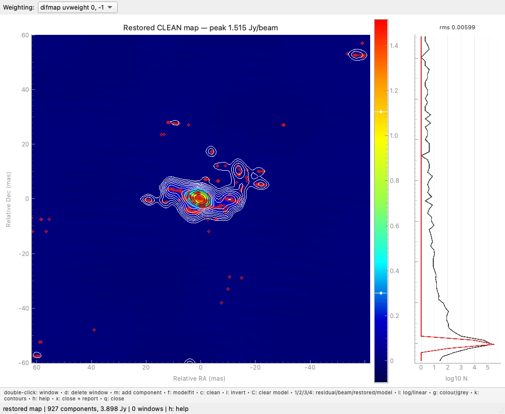
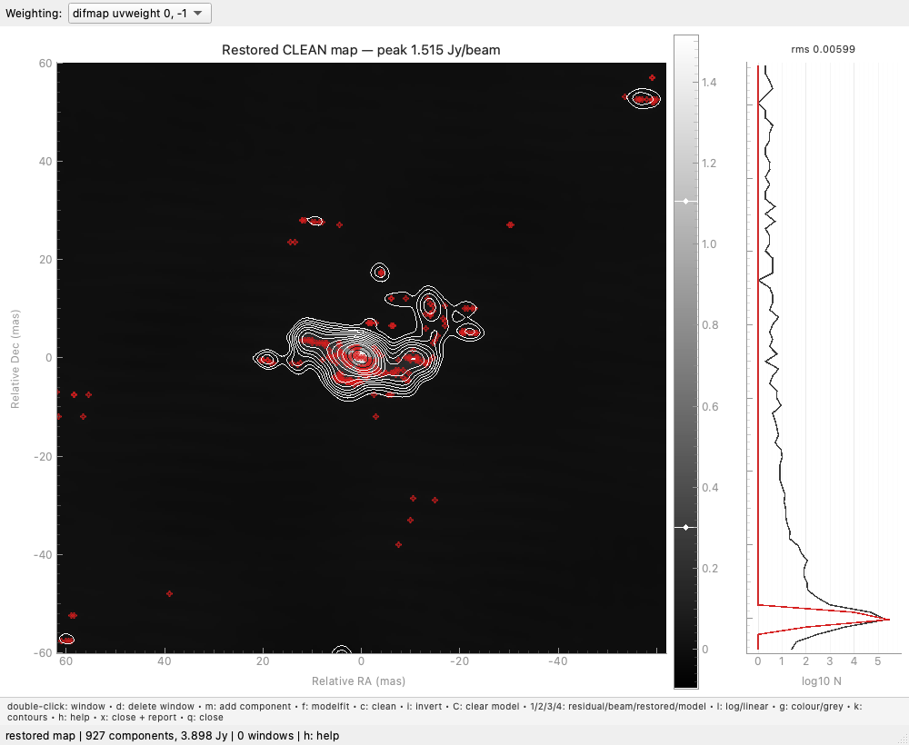

# The map display

```python
obs.mapplot()                         # also spelled maplot()
obs.mapplot(mapsize=2048, cellsize=0.5, uvweight=0)
obs.mapplot(what="clean", cmap="grey", scale="log")
```

`mapsize` (pixels), `cellsize` (mas) and `uvweight` (a Briggs
robustness) override the current imaging setup. With none given and
`mapsize()` never called, the window images 4096 pixels of a tenth of
the estimated resolution, and prints the beam it is showing.

{ loading=lazy }

## Keys

| key | action |
| --- | --- |
| double-click | add a CLEAN window (drag it to move or resize) |
| ++d++ | delete the window under the cursor |
| ++c++ / ++i++ | CLEAN / re-invert |
| ++1++ ++2++ ++3++ ++4++ | residual map, dirty beam, restored map, model |
| ++m++ | add a model component: click the centre, then any two points on it |
| ++d++ (while adding) | a point source, then a circular Gaussian |
| ++f++ | fit the placed components to the UV data |
| ++shift+c++ | clear every model component |
| ++l++ | logarithmic or linear colour scale |
| ++g++ | pseudo-colour or grey scale (black and white) |
| ++k++ | contours on the restored map on / off |
| ++z++ / ++u++ | restore the y / x axis range |
| ++r++ | reload the plot from the data |
| ++x++ | close and report the image properties |
| ++h++ / ++q++ | key legend / close |

The main keys also run along the bottom of the window, and a heading
over the image names what is being displayed, with its peak.

## Colours

The image is shown as Difmap shows it: in its pseudo-colour table (dark
blue through cyan, green and yellow to red) or, with ++g++, its grey
scale, with the colours spanning the displayed map **from its minimum
to its peak**. The noise then stays dark and the source stands out.

{ loading=lazy }

- `mapplot(cmap="grey")` starts in black and white; `cmap="viridis"` is
  also available.
- ++l++, or `mapplot(scale="log")`, redistributes the same colours
  logarithmically, for faint structure. The stretch is applied to the
  colour map, not to the pixel values, so the colour bar stays in
  Jy/beam and negative residuals keep their place.
- Drag the two handles on the colour bar to set any other range.

Beside the colour bar is a histogram of the displayed pixel values with
a Gaussian fitted to the residual noise.

## Contours

The restored map (++3++) is drawn with contours: solid from **3 times
the noise** of the residual map upwards in **factors of √2**, and dashed
for the negative levels from -3σ down. Each contour is drawn light or
dark, whichever stands out against the colours at its level, and follows
the colour bar when its range changes. ++k++ turns them off and on.

## Weighting

The "Weighting" box above the image switches between Difmap's own
`uvweight` scheme and Briggs robust -2, -1, 0, +1, +2, and re-images
straight away. The choice stays set after the window closes, as a call
to `uvweight()` would leave it.

## Placing and fitting components

A component placed with ++m++ is only *drawn* at first: the flux it
starts from is a guess read off the map, so it is kept out of the image
until ++f++ fits it to the UV data, together with the rest of the model.
Placing one therefore never changes the map underneath it. Closing the
window adds any component still unfitted to the model.

The two points clicked after the centre need be neither the major and
minor axes nor at right angles: the longer one sets the major axis and
the other is solved for the axial ratio.

## When the window closes

++x++ prints the image properties - beam, peak position and flux, model
components, total flux, residual rms - and leaves them in the returned
object's `result`. They are the same as `obs.mapinfo()`.
