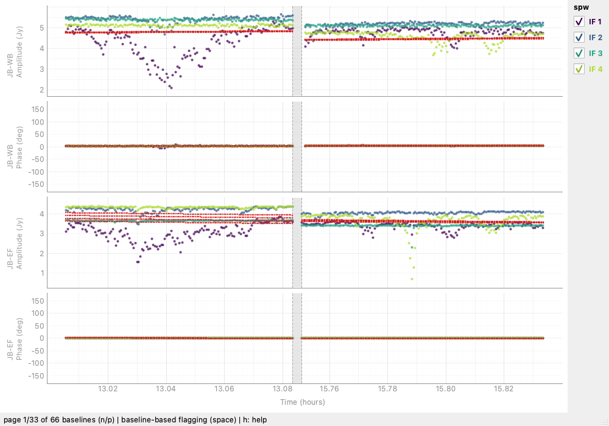
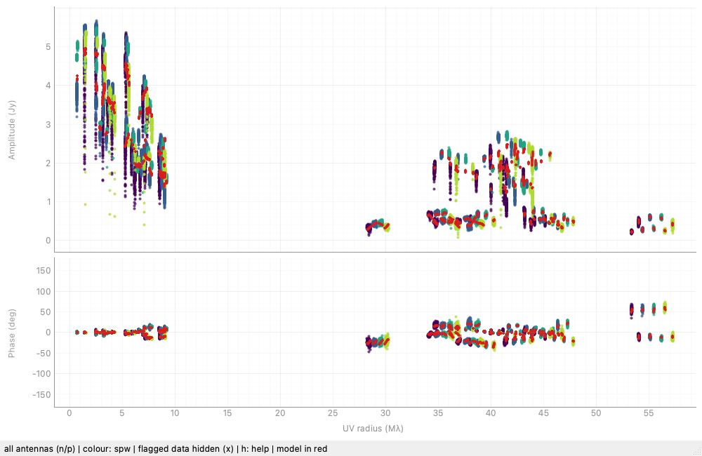

# Plots

| command | shows |
|---|---|
| [`mapplot()`](mapplot.md) | the map, with CLEAN windows, model components and contours |
| `radplot()` | amplitude and phase against uv radius, the model in red |
| `projplot(angle)` | the same against uv distance projected at a position angle |
| `uvplot()` | the uv coverage |
| `vplot(nplot, reftel)` | amplitude and phase against time, per baseline |
| `fplot()` | amplitude and phase against frequency, per baseline |
| `specplot()` | the same, averaged over all baselines |
| `cpplot()` | closure phases against the model |
| `tplot()` | time sampling per station |
| `corplot()` | the self-calibration corrections per station |

{ loading=lazy }

`vplot` takes Difmap's argument order: `vplot(3)` shows three baselines
a page, and `vplot(3, "EF")` only those of EF.

{ loading=lazy }

## Keys common to every plot

| key | action |
| --- | --- |
| ++z++ | restore the y axis range (phase panels return to ±180°) |
| ++u++ | restore the x axis range |
| ++r++ | reload the plot from the data |
| ++h++ | the key legend of the plot in front |
| ++n++ / ++p++ | next / previous page, in paged plots |

++r++ matters because a window does not know when the data behind it
change: flag, calibrate, `ignore` a station or re-image from the prompt,
then press ++r++ to catch up.

Flagging with the mouse is described under
[Flagging](flagging.md#in-the-plots).

## Time axes

Plots against time (`vplot`, `tplot`, `corplot`, `cpplot`) cut out any
gap between integrations longer than 10% of the observation, so scans
hours apart sit side by side instead of leaving most of the axis empty.
The cuts are shaded, and the axis still reads real times.

## Against frequency

`fplot()` is `vplot`'s frequency counterpart: amplitude and phase per
baseline, every channel of every IF averaged over the whole observation
(or over `tmin`..`tmax`). Amplitudes are scalar-averaged, so they do not
decorrelate as the fringe turns; phases come from the vector average,
which is what makes a slope across the band visible.

Both `fplot` and `specplot` draw on `obs.spectrum()`, which averages
*all* channels - the unselected ones too, so it can be used to choose
them - with the accumulated calibration applied. `calibrated=False`
averages the data as loaded.

## Windows

Open windows are kept alive for you, so `mapplot()` at the prompt stays
open without having to hold on to the returned object, and they are
closed when the session ends. `difmapy.plots.open_windows()` lists them
and `close_all_windows()` shuts them all.

## Notebooks and pipelines

Every plot also works without a window. In a Jupyter notebook - or
anywhere without a display, such as a server or a CI job - plots are
drawn off-screen and shown in the cell output, and every plot command
returns an object that can be saved:

```python
obs.radplot()                              # appears in the notebook
p = obs.vplot(3)
p.savefig("plots/vplot_{page}.png")        # every page, numbered from 1
obs.mapplot().savefig("map.png", width=1400, height=1000)
p.set_page(2); p                           # show page 3 inline
```

`difmapy.plots.set_mode("window")` switches a notebook to interactive Qt
windows instead; `"inline"` forces off-screen plots anywhere, and
`"auto"` is the default. The environment variable `DIFMAPY_PLOT_MODE`
sets the same from outside, and `difmapy --batch` always draws inline.

Paged plots take `set_page(n)` in place of the ++n++ / ++p++ keys, and
`radplot`'s antenna highlight and `projplot`'s angle have
`cycle_antenna()` and `rotate_projection()`.
